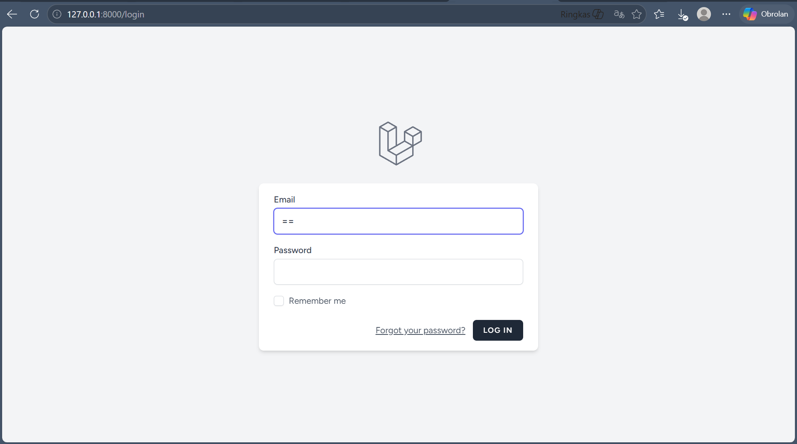
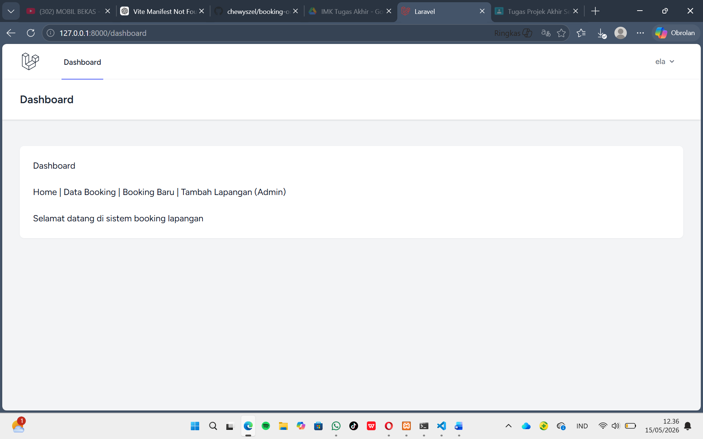
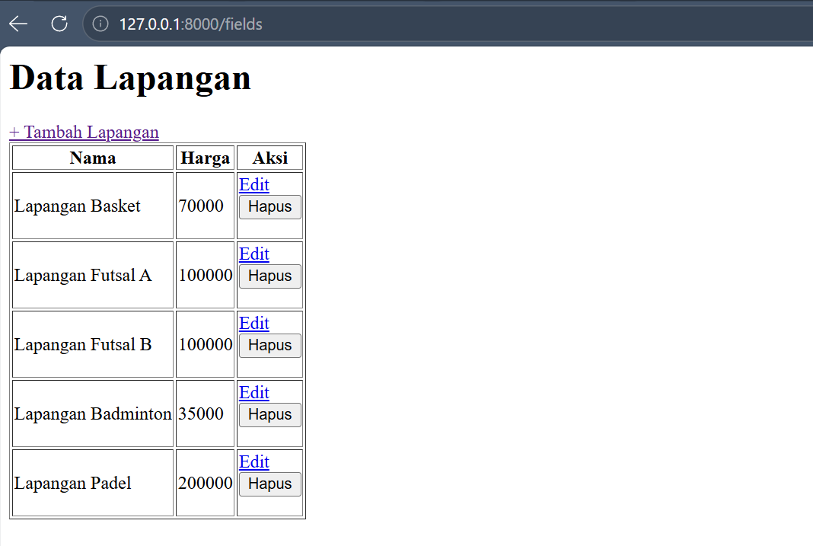
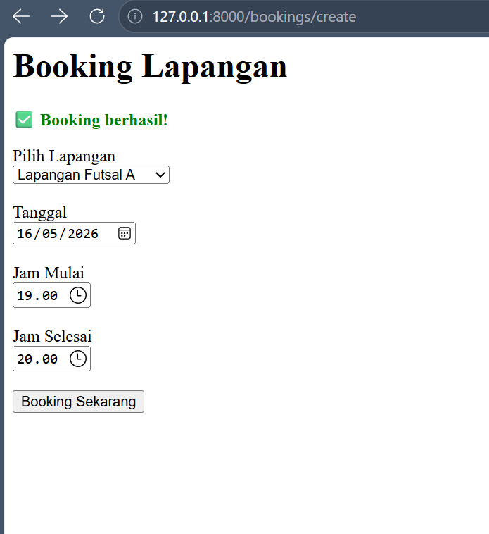
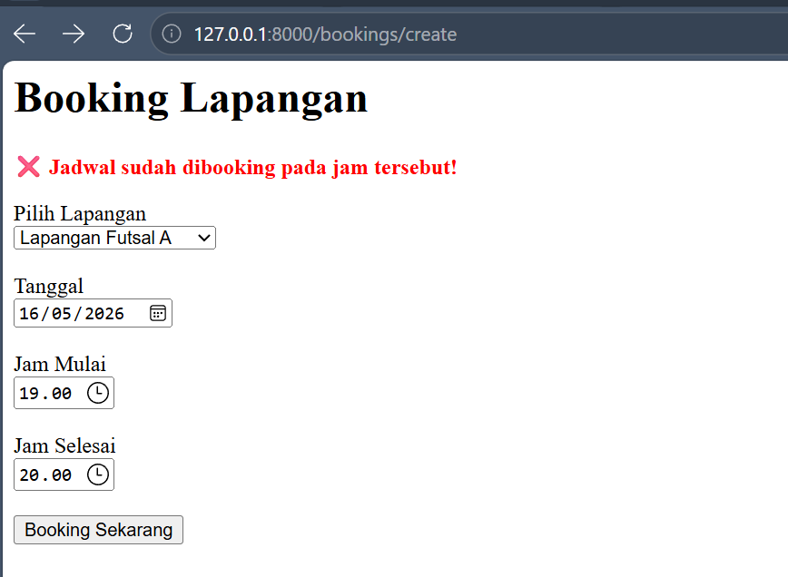
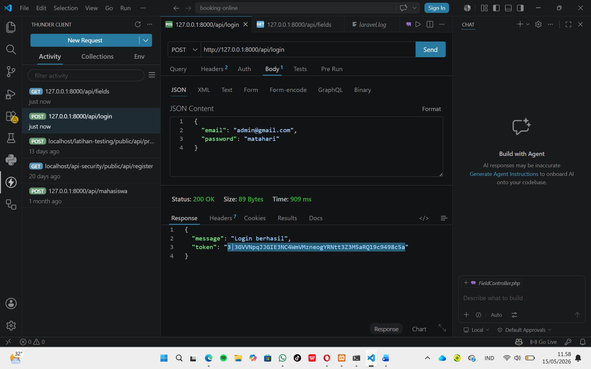
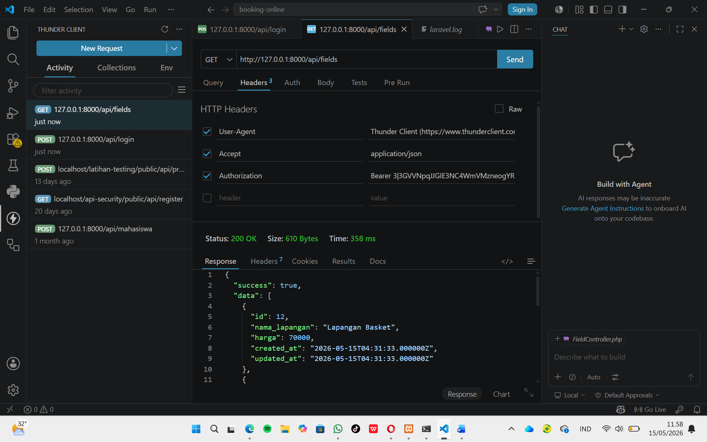

# Booking Online Laravel

## Deskripsi
Booking Online Laravel adalah aplikasi berbasis web yang digunakan untuk melakukan pemesanan lapangan secara online. Sistem ini dibuat menggunakan framework Laravel 12 dan dilengkapi dengan fitur autentikasi, CRUD data lapangan, REST API, serta keamanan API menggunakan Laravel Sanctum.

---

# Fitur Utama

- Login & Register User
- Authentication Laravel Breeze
- Authorization Role Admin & User
- CRUD Data Lapangan
- Booking Lapangan Online
- RESTful API
- JSON Response API
- Validasi Request
- API Security Laravel Sanctum
- Middleware Proteksi
- Unit Test
- Feature Test

---

# Teknologi yang Digunakan

- Laravel 12
- PHP 8.2
- MySQL
- Laravel Sanctum
- Laravel Breeze
- Bootstrap / Tailwind CSS
- Thunder Client / Postman
- Git & GitHub

---

# Struktur Database

## Tabel Users
- id
- name
- email
- password
- role

## Tabel Fields
- id
- nama_lapangan
- harga

## Tabel Bookings
- id
- user_id
- field_id
- tanggal
- jam

---

# Relasi Database

- User memiliki banyak booking
- Lapangan memiliki banyak booking
- Booking dimiliki oleh satu user
- Booking terkait dengan satu lapangan

---

# Cara Install Project

## 1. Clone Repository

```bash
git clone https://github.com/chewyszel/booking-online.git
```

---

## 2. Masuk Folder Project

```bash
cd booking-online
```

---

## 3. Install Dependency Laravel

```bash
composer install
```

---

## 4. Install Node Modules

```bash
npm install
```

---

## 5. Copy File Environment

```bash
cp .env.example .env
```

---

## 6. Generate Key Laravel

```bash
php artisan key:generate
```

---

## 7. Atur Database di .env

```env
DB_DATABASE=booking_online
DB_USERNAME=root
DB_PASSWORD=
```

---

## 8. Jalankan Migration

```bash
php artisan migrate
```

---

## 9. Jalankan Server Laravel

```bash
php artisan serve
```

---

# Authentication & Authorization

Sistem menggunakan:
- Laravel Breeze untuk authentication
- Middleware auth untuk proteksi halaman
- Laravel Sanctum untuk keamanan API
- Role Admin & User untuk authorization

---

# RESTful API

## Login API

### Endpoint

```http
POST /api/login
```

### Request

```json
{
  "email": "admin@gmail.com",
  "password": "password"
}
```

### Response

```json
{
  "message": "Login berhasil",
  "token": "1|xxxxx"
}
```

---

# API Endpoint

| Method | Endpoint | Fungsi |
|---|---|---|
| POST | /api/login | Login API |
| GET | /api/fields | Menampilkan data lapangan |
| GET | /api/fields/{id} | Detail lapangan |
| POST | /api/bookings | Tambah booking |
| GET | /api/bookings | List booking |

---

# API Security

Project ini menggunakan Laravel Sanctum sebagai keamanan API berbasis token.

Endpoint API dilindungi menggunakan middleware:

```php
Route::middleware('auth:sanctum')->group(function () {

});
```

---

# Testing

## Unit Test

```bash
php artisan make:test FieldTest --unit
```

## Feature Test

```bash
php artisan make:test LoginTest
```

## Menjalankan Test

```bash
php artisan test
```

---

# Dokumentasi

Dokumentasi project meliputi:
- ERD
- Flow Sistem
- Dokumentasi API
- Screenshot Sistem
- Testing

---

# Deployment

Project di-deploy menggunakan:
- GitHub Repository

Repository:
https://github.com/chewyszel/booking-online

---

# Author

Nama: Chewyszel

---

# License

Project ini dibuat untuk kebutuhan pembelajaran dan tugas perkuliahan.
# Screenshot Sistem

## Login Page



---

## Dashboard



---

## CRUD Lapangan



---

## Booking Lapangan



---



---

## API Testing



---

